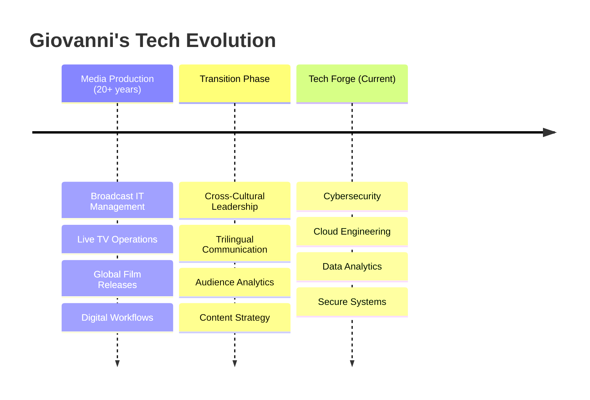

# Digital-Forge | Giovanni Oliveira 锻

---

### 👋 Welcome to My Digital Forge

*Transforming 20+ years of media production and IT expertise into cutting-edge cybersecurity, cloud engineering, and data analytics solutions.*

> *"Technology is a tool for human flourishing. My work is to ensure it remains a safe and reliable one."*

---

## 🔗 Quick Navigation

---

## 🌟 Professional Journey

**From Broadcasting to Cybersecurity**: Transitioning from media leadership to tech, my background in broadcasting (managing IT for live TV, global film releases at Record TV) provides unique insights into secure digital workflows, audience analytics, and cross-cultural collaboration. As a trilingual professional (🇧🇷 Portuguese, 🇲🇽 Spanish, 🇺🇸 English), I apply methodical problem-solving from Broadcast IT Manager roles to forge resilient tech solutions.

---

## 📂 Domains of Practice

<h3>🛡️ Cybersecurity</h3>

*Defending systems, detecting threats, and responding with precision. Built on IT troubleshooting experience in broadcast environments.*

 
 

| Project Area | Description | Key Technologies |
|:---|:---|:---|
| **Network Defense** | Tools for traffic analysis and threat detection |    |
| **System Hardening** | Labs and scripts for securing operating systems |    |
| **Incident Response** | Playbooks and bots for automated handling |    |

<h3>☁️ Cloud Engineering </h3>

*Infrastructure as Code and cloud-native solutions for secure scalability. Inspired by digital content delivery and OTT optimizations.*

 

| Project Area | Description | Key Technologies |
|:---|:---|:---|
| **Infrastructure as Code** | Secure blueprints for deploying resources |    |
| **Cloud Security** | Tools for auditing cloud environments |   |

<h3>📊 Data Analytics </h3>

*Secure data handling and visualization for informed decisions. Leverages audience analytics experience from UNIFE and Record marketing strategies.*

 

| Project Area | Description | Key Technologies |
|:---|:---|:---|
| **Data Protection** | Labs for preventing SQL injection attacks |    |
| **Log Analysis** | Scripts for parsing logs and risk reports |    |

---

## 🛠️ Technical Arsenal

### Programming Languages

### Security & DevOps Tools

### Platforms & Infrastructure

### Security Frameworks

### Media Production Legacy

---

## 🌍 Soft Skills & Leadership

---

## 📊 GitHub Stats

---

## 🤝 Collaboration & Community

### How to Get Involved

1. **📖 Read** our [Contributing Guidelines](docs/CONTRIBUTING.md)
2. **🔍 Explore** the projects and documentation
3. **🐛 Report** issues or suggest improvements
4. **🛡️ Report** security vulnerabilities via our [Security Policy](docs/SECURITY.md)
5. **💬 Engage** respectfully following our [Code of Conduct](docs/CODE_OF_CONDUCT.md)

---

## 📜 License & Ethics

*This work is governed by principles of integrity, responsibility, and human-centered technology.*

---

**🔨 Built with passion for secure, ethical technology**

*"In the forge of digital transformation, we shape tools that serve humanity."*

