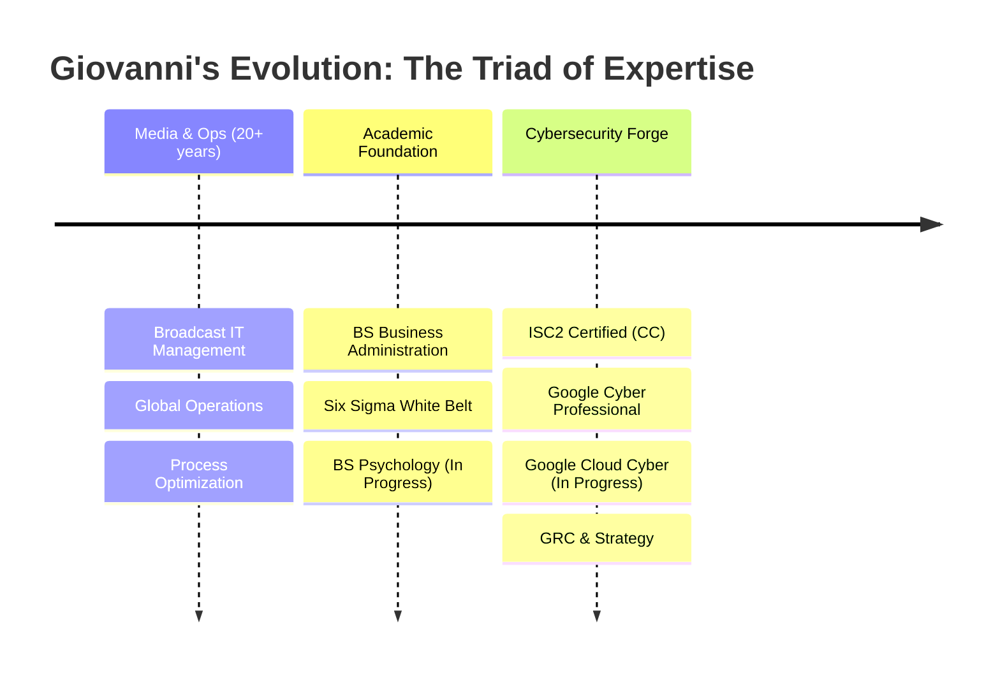

# Digital-Forge | Giovanni Oliveira 锻

---

### 👋 Welcome to My Digital Forge

*Forging resilient systems at the intersection of Cybersecurity, Business Strategy, and Human Psychology.*

> *"Security is not just code; it's a culture of continuous improvement (Kaizen) and human-centric design. I apply Six Sigma precision to protect digital assets and Business Intelligence to drive value."*

---

## 🔗 Quick Navigation

---

## 🌟 Professional Journey

**The Triad: Tech, Business, & Mind**: My approach is unique because it blends three critical disciplines:

1. **Technical Mastery**: Deep roots in Broadcast IT and modern Cybersecurity (ISC2 & Google certified).
2. **Business Acumen**: A BS in Business Administration and Six Sigma methodology ensures my security solutions align with business goals and ROI.
3. **Human Factors**: Pursuing a BS in Psychology allows me to understand the "human element" of security—social engineering, insider threats, and security culture.

---

---

## 🎓 Certifications & Academia

| **Cybersecurity & Cloud** | **Business & Process** | **Academia** |
| :--- | :--- | :--- |
|  |  | **BS Business Admin** (UoPeople) |
|  | **Business Strategy** | **BS Psychology** (Capella U - *Enrolled*) |
| -4285F4?logo=google-cloud&logoColor=white) | **Marketing & Brand** | |

---

## 📂 Domains of Practice

<h3>🛡️ Cybersecurity & GRC</h3>

*Defending systems through Defense-in-Depth and Six Sigma Root Cause Analysis. I don't just patch vulnerabilities; I optimize the processes that allowed them.*

 
 

| Project Area | Description | Key Technologies |
|:---|:---|:---|
| **Network Defense** | Tools for traffic analysis and threat detection |    |
| **System Hardening** | Labs and scripts for securing operating systems |    |
| **Incident Response** | [Standardized Playbooks](1-Cybersecurity/1.3-Incident-Response/ir-playbooks) and automated handling |    |

<h3>📊 Data Analytics</h3>

*Transforming raw logs into actionable intelligence. Using Python and SQL to detect patterns that humans miss.*

 

| Project Area | Description | Key Technologies |
|:---|:---|:---|
| **Log Analysis** | High-performance parsers for security logs |   |
| **Data Protection** | SQL hardening and injection defense |   |

<h3>🚀 Process Improvement & Business Excellence</h3>

*Applying Six Sigma precision and Business Administration principles to optimize security operations and ROI.*

 

| Project Area | Description | Key Technologies |
|:---|:---|:---|
| **Root Cause Analysis** | DMAIC application for security incidents |  |
| **Strategy & ROI** | Aligning security spend with business goals |  |

<h3>☁️ Cloud Engineering</h3>

*Infrastructure as Code and cloud-native solutions for secure scalability. Inspired by digital content delivery and OTT optimizations.*

 

| Project Area | Description | Key Technologies |
|:---|:---|:---|
| **Infrastructure as Code** | Secure blueprints for deploying resources |    |
| **Cloud Security** | Tools for auditing cloud environments |   |

<h3>🧠 Psychology & Human Factors</h3>

*Understanding the human element the target of 90% of cyber attacks. Applying psychological principles to defense.*

| Project Area | Description | Key Technologies |
|:---|:---|:---|
| **Phishing Analysis** | Psychological trigger identification |  |
| **Culture Change** | Behavioral security training models |  |

---

## 🛠️ Technical Arsenal

### Programming Languages

### Security & DevOps Tools

### Platforms & Infrastructure

### Security Frameworks

### Media Production & Legacy

*20+ years of experience in broadcast operations, digital content delivery, and technical management. This background provides a unique perspective on secure content workflows and system resilience.*

---

## 🧠 Human Factors & Leadership

---

## 📊 GitHub Stats

---

## 🤝 Collaboration & Community

### How to Get Involved

1. **📖 Read** our [Contributing Guidelines](docs/CONTRIBUTING.md)
2. **🔍 Explore** the projects and documentation
3. **🐛 Report** issues or suggest improvements
4. **🛡️ Report** security vulnerabilities via our [Security Policy](docs/SECURITY.md)
5. **💬 Engage** respectfully following our [Code of Conduct](docs/CODE_OF_CONDUCT.md)

---

## 📜 License & Ethics

*This work is governed by principles of integrity, responsibility, and human-centered technology.*

---

**🔨 Built with passion for secure, ethical technology**

*"In the forge of digital transformation, we shape tools that serve humanity."*

